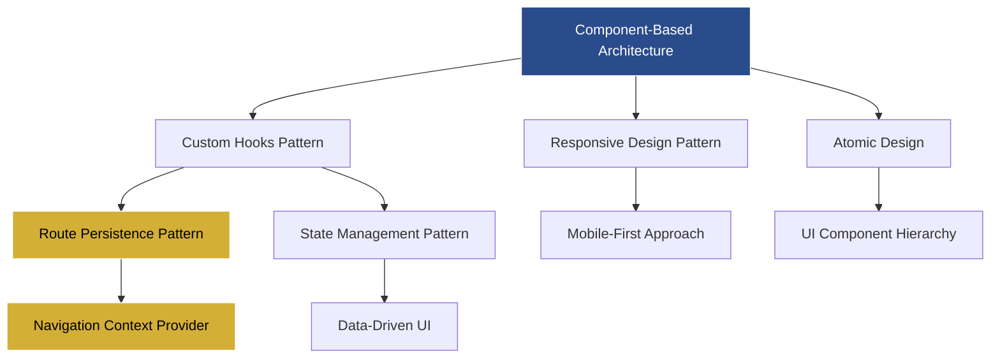
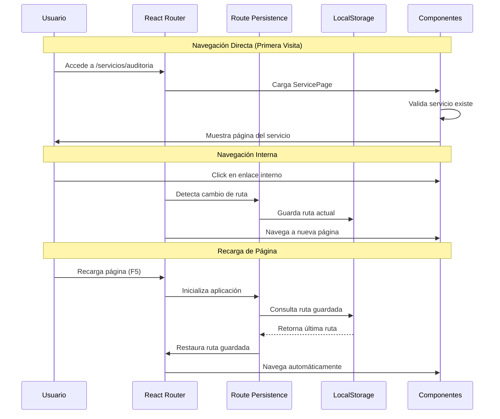
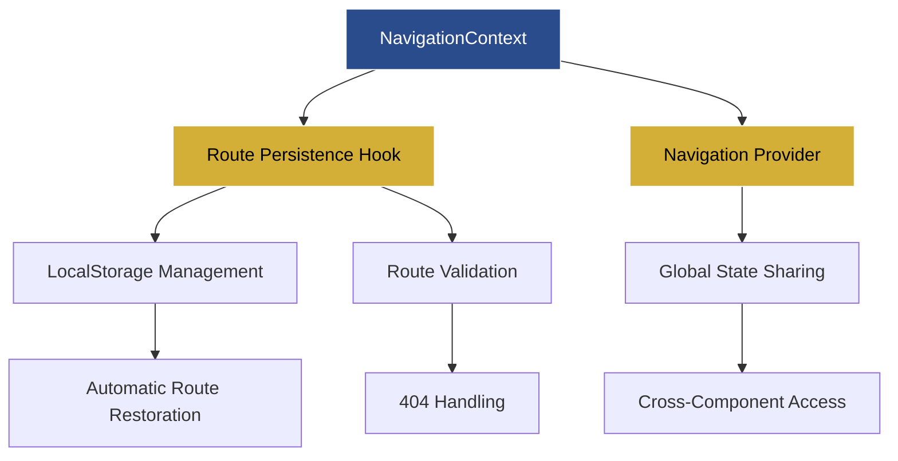

<div align="center">
  
  
  # 🏢 Cuenca & Asociados
  ### Plataforma Web Profesional de Auditoría Financiera, Contable y Tributaria
  
  <p align="center">
    <strong>Soluciones integrales de auditoría con tecnología de vanguardia y navegación persistente</strong>
  </p>
  
  <p align="center">
    
    
    
    
  </p>
  
  <p align="center">
    
    
    
    
  </p>
</div>

---

## 📋 Tabla de Contenidos

- [🎯 Descripción del Proyecto](#-descripción-del-proyecto)
- [✨ Características Principales](#-características-principales)
- [🛠️ Stack Tecnológico](#️-stack-tecnológico)
- [🏗️ Arquitectura del Proyecto](#️-arquitectura-del-proyecto)
- [🔄 Sistema de Navegación y Persistencia](#-sistema-de-navegación-y-persistencia)
- [🚀 Instalación y Configuración](#-instalación-y-configuración)
- [📱 Características Técnicas](#-características-técnicas)
- [🎨 Sistema de Diseño](#-sistema-de-diseño)
- [📁 Estructura de Archivos](#-estructura-de-archivos)
- [🔧 Scripts Disponibles](#-scripts-disponibles)
- [🌐 Despliegue](#-despliegue)
- [📄 Licencia](#-licencia)

---

## 🎯 Descripción del Proyecto

**Cuenca & Asociados** es una aplicación web profesional de última generación, desarrollada con **React 18** y **TypeScript**, que ofrece servicios especializados de auditoría financiera, contable y tributaria. La plataforma combina un diseño moderno y responsivo con funcionalidades avanzadas de interacción y **navegación persistente**, proporcionando una experiencia de usuario excepcional tanto para clientes como para profesionales del sector.

### 🎪 Propósito Empresarial

La aplicación está diseñada para:
- **Presentar servicios profesionales** de manera elegante y accesible
- **Facilitar la comunicación** entre la firma y sus clientes
- **Optimizar la experiencia de usuario** con navegación persistente en todos los dispositivos
- **Garantizar acceso directo** a cualquier sección mediante URLs específicas
- **Demostrar excelencia técnica** que refleje la calidad de los servicios ofrecidos

---

## ✨ Características Principales

### 🎭 **Experiencia de Usuario Inmersiva**
- **Animaciones fluidas** con Framer Motion y AOS
- **Transiciones suaves** entre secciones y páginas
- **Micro-interacciones** que mejoran la experiencia de navegación
- **Diseño responsivo** optimizado para móviles, tablets y escritorio
- **Navegación persistente** que mantiene el estado al recargar

### 🔄 **Sistema de Navegación Avanzada**
- **Persistencia de rutas** que mantiene la vista actual al recargar la página
- **Navegación directa** mediante URLs específicas para acceso inmediato
- **Validación automática** de rutas con redirección inteligente
- **Estado de navegación** sincronizado entre sesiones
- **Deep linking** completo para compartir enlaces específicos

### 🏢 **Presentación Profesional de Servicios**
- **Catálogo dinámico** de servicios de auditoría
- **Páginas de detalle** con información completa de cada servicio
- **Slider interactivo** para presentación visual de servicios
- **Sistema de navegación** intuitivo y accesible
- **URLs semánticas** para cada servicio individual

### 🎨 **Diseño Moderno y Adaptativo**
- **Sistema de diseño** consistente basado en Tailwind CSS
- **Componentes reutilizables** con Shadcn/UI y Radix UI
- **Tipografía profesional** con Google Fonts (Poppins y Playfair Display)
- **Paleta de colores corporativa** personalizada

### 📱 **Optimización Multiplataforma**
- **Detección automática** de dispositivos móviles y tablets
- **Menú adaptativo** para diferentes tamaños de pantalla
- **Optimización de rendimiento** para cargas rápidas
- **Accesibilidad mejorada** siguiendo estándares web

---

## 🛠️ Stack Tecnológico

### 🚀 **Frontend Core**
| Tecnología | Versión | Propósito |
|------------|---------|-----------|
| **React** | 18.3.1 | Biblioteca principal para construcción de UI |
| **TypeScript** | 5.0+ | Tipado estático para mayor robustez |
| **Vite** | 6.3.0 | Build tool y dev server ultrarrápido |
| **React Router DOM** | 6.26.2 | Navegación, enrutamiento SPA y persistencia |

### 🎨 **Styling y UI**
| Tecnología | Versión | Propósito |
|------------|---------|-----------|
| **Tailwind CSS** | 4.1.0 | Framework de utilidades CSS |
| **Shadcn/UI** | Latest | Componentes UI pre-construidos |
| **Radix UI** | Latest | Primitivos de UI accesibles |
| **Tailwind Animate** | 1.0.7 | Animaciones CSS optimizadas |

### ⚡ **Animaciones y Interacciones**
| Tecnología | Versión | Propósito |
|------------|---------|-----------|
| **Framer Motion** | 12.5.0 | Animaciones React avanzadas |
| **AOS** | 2.3.4 | Animaciones al scroll |
| **Lucide React** | 0.462.0 | Iconografía moderna |

### 🔧 **Herramientas de Desarrollo**
| Tecnología | Versión | Propósito |
|------------|---------|-----------|
| **React Hook Form** | 7.53.0 | Gestión de formularios |
| **TanStack Query** | 5.56.2 | Estado del servidor y cache |
| **Zod** | 3.23.8 | Validación de esquemas |
| **Class Variance Authority** | 0.7.1 | Gestión de variantes de componentes |

---

## 🏗️ Arquitectura del Proyecto

### 📐 **Patrones de Diseño Implementados**



### 🔄 **Flujo de Datos y Navegación**



### ⚡ **Performance Optimization Patterns**

```mermaid
graph LR
    A[Code Splitting] --> B[Lazy Loading]
    B --> C[Bundle Optimization]
    C --> D[Tree Shaking]
    D --> E[Memory Management]
    E --> F[Route Caching]
    
    A1[React.lazy()] --> A
    B1[Suspense Boundaries] --> B
    C1[Vite Optimization] --> C
    D1[ES Modules] --> D
    E1[Observer Cleanup] --> E
    F1[Route Persistence] --> F
    
    style A fill:#61DAFB,stroke:#fff,color:#000
    style B fill:#61DAFB,stroke:#fff,color:#000
    style C fill:#646CFF,stroke:#fff,color:#fff
    style D fill:#646CFF,stroke:#fff,color:#fff
    style E fill:#FF6B6B,stroke:#fff,color:#fff
    style F fill:#4ECDC4,stroke:#fff,color:#000
```

### 🎯 **Estrategias de Optimización Avanzadas**

- **Code Splitting Inteligente**: Carga dinámica de páginas con `React.lazy()`
- **Intersection Observer**: Optimización de animaciones y detección de visibilidad
- **Memory Leak Prevention**: Limpieza automática de event listeners y observers
- **Throttled Scroll Events**: Optimización de eventos de scroll con `requestAnimationFrame`
- **Route-Based Caching**: Sistema de caché basado en rutas para mejor rendimiento
- **Bundle Size Optimization**: Eliminación de código no utilizado con tree shaking
- **Progressive Enhancement**: Funcionalidades que se degradan graciosamente

---

## 🔄 Sistema de Navegación y Persistencia

### 🧭 **Arquitectura de Navegación**

La aplicación implementa un sistema avanzado de navegación que garantiza una experiencia de usuario fluida y profesional:



### 🔧 **Funcionalidades del Sistema**

#### **Persistencia de Rutas**
- **Almacenamiento automático** de la ruta actual en `localStorage`
- **Restauración inteligente** al recargar la página
- **Validación de timestamp** para evitar rutas obsoletas (24 horas)
- **Limpieza automática** de datos corruptos o inválidos

#### **Navegación Directa**
- **Deep linking completo** para acceso directo a cualquier sección
- **Validación de rutas** con redirección automática para URLs inválidas
- **URLs semánticas** que reflejan la estructura de contenido
- **Soporte para parámetros** dinámicos en rutas de servicios

#### **Gestión de Estado**
- **Context API** para compartir estado de navegación globalmente
- **Custom hooks** para encapsular lógica de persistencia
- **Patrones de limpieza** para prevenir memory leaks
- **Inicialización controlada** para evitar renderizados innecesarios

### 📱 **Casos de Uso Empresariales**

1. **Acceso Directo a Servicios**: Los clientes pueden acceder directamente a información específica de servicios mediante enlaces compartidos
2. **Continuidad de Sesión**: Los usuarios mantienen su contexto de navegación al recargar accidentalmente
3. **Optimización SEO**: URLs semánticas mejoran la indexación en motores de búsqueda
4. **Experiencia Móvil**: Navegación optimizada para dispositivos táctiles con persistencia

---

## 🚀 Instalación y Configuración

### 📋 **Prerrequisitos**

- **Node.js** >= 18.0.0
- **npm** >= 9.0.0 o **yarn** >= 1.22.0
- **Git** para control de versiones

### 🔧 **Instalación**

```bash
# Clonar el repositorio
git clone https://github.com/tu-usuario/cuenca-asociados.git

# Navegar al directorio
cd cuenca-asociados

# Instalar dependencias
npm install

# Iniciar servidor de desarrollo
npm run dev
```

### 🌐 **Acceso Local**

Una vez iniciado el servidor de desarrollo:
- **URL**: `http://localhost:8080`
- **Network**: Accesible desde otros dispositivos en la red local
- **Hot Reload**: Cambios automáticos en tiempo real
- **Route Testing**: Prueba URLs directas como `http://localhost:8080/servicios/auditoria-financiera`

---

## 📱 Características Técnicas

### 🎯 **Optimizaciones de Rendimiento**

- **Code Splitting**: Carga dinámica de componentes con `React.lazy()`
- **Lazy Loading**: Imágenes y componentes bajo demanda
- **Tree Shaking**: Eliminación de código no utilizado
- **Bundle Optimization**: Minificación y compresión automática
- **Route Caching**: Sistema de caché para navegación instantánea
- **Memory Management**: Limpieza automática de observers y listeners

### 🔍 **SEO y Accesibilidad**

- **Meta Tags Dinámicos**: Optimización específica por página
- **Semantic HTML**: Estructura semántica correcta
- **ARIA Labels**: Etiquetas de accesibilidad completas
- **Keyboard Navigation**: Navegación por teclado completa
- **URL Semánticas**: Estructura de URLs optimizada para SEO
- **Open Graph**: Metadatos para redes sociales

### 📊 **Monitoreo y Analytics**

- **Performance Monitoring**: Métricas de rendimiento en tiempo real
- **Error Tracking**: Seguimiento de errores con contexto de ruta
- **User Analytics**: Análisis de comportamiento de navegación
- **Route Analytics**: Seguimiento de rutas más visitadas

### 🔒 **Robustez y Confiabilidad**

- **Error Boundaries**: Manejo elegante de errores de React
- **Validation Patterns**: Validación estricta de rutas y datos
- **Fallback Mechanisms**: Estrategias de degradación graceful
- **Type Safety**: TypeScript estricto para prevenir errores

---

## 🎨 Sistema de Diseño

### 🎨 **Paleta de Colores Corporativa**

```css
/* Colores principales de Cuenca & Asociados */
cuenca-blue: #2A4B8C    /* Azul corporativo principal */
cuenca-gold: #D4AF37    /* Dorado para acentos */
cuenca-light: #F5F5F7   /* Gris claro para fondos */
cuenca-dark: #1D1D1F    /* Gris oscuro para texto */
```

### 📝 **Tipografía**

- **Primary**: Poppins (Sans-serif) - Para títulos y texto general
- **Secondary**: Playfair Display (Serif) - Para elementos decorativos

### 📐 **Breakpoints Responsivos**

```css
mobile: < 768px     /* Smartphones */
tablet: 768px - 1024px   /* Tablets */
desktop: >= 1024px  /* Escritorio y pantallas grandes */
```

### 🎭 **Sistema de Animaciones**

- **Micro-interacciones**: Feedback inmediato en interacciones
- **Page Transitions**: Transiciones suaves entre páginas
- **Scroll Animations**: Animaciones activadas por scroll
- **Loading States**: Estados de carga consistentes

---

## 📁 Estructura de Archivos

```
src/
├── 📁 components/           # Componentes React reutilizables
│   ├── 📁 ui/              # Componentes UI base (Shadcn/UI)
│   ├── 📄 About.tsx        # Sección "Acerca de"
│   ├── 📄 Contact.tsx      # Formulario de contacto
│   ├── 📄 Footer.tsx       # Pie de página
│   ├── 📄 Header.tsx       # Navegación principal
│   ├── 📄 Hero.tsx         # Sección hero principal
│   ├── 📄 ServiceDetail.tsx # Detalle de servicios
│   ├── 📄 Services.tsx     # Lista de servicios
│   └── 📄 ServicesSlider.tsx # Carrusel de servicios
├── 📁 contexts/            # Contextos de React
│   └── 📄 NavigationContext.tsx # Contexto de navegación y persistencia
├── 📁 data/                # Datos y configuraciones
│   ├── 📄 logoData.ts      # Información del logotipo
│   ├── 📄 services.ts      # Catálogo de servicios
│   └── 📄 serviceHero.ts   # Configuración de hero de servicios
├── 📁 hooks/               # Custom hooks de React
│   ├── 📄 use-device.tsx   # Detección de dispositivos
│   ├── 📄 use-logo.tsx     # Gestión del logotipo
│   ├── 📄 use-mobile.tsx   # Detección móvil simplificada
│   ├── 📄 use-mobile-menu.tsx # Control del menú móvil
│   ├── 📄 use-route-persistence.tsx # Persistencia de rutas
│   └── 📄 use-toast.ts     # Sistema de notificaciones
├── 📁 lib/                 # Utilidades y helpers
│   └── 📄 utils.ts         # Funciones de utilidad
├── 📁 pages/               # Páginas principales
│   ├── 📄 Index.tsx        # Página de inicio
│   ├── 📄 NotFound.tsx     # Página 404
│   └── 📄 ServicePage.tsx  # Página de servicio individual
├── 📄 App.tsx              # Componente principal con providers
├── 📄 main.tsx             # Punto de entrada
└── 📄 index.css            # Estilos globales y variables CSS
```

---

## 🔧 Scripts Disponibles

```bash
# Desarrollo
npm run dev          # Inicia servidor de desarrollo con HMR
npm run build        # Construye para producción optimizada
npm run preview      # Previsualiza build de producción
npm run lint         # Ejecuta linting del código

# Mantenimiento
npm run type-check   # Verificación de tipos TypeScript
npm run format       # Formatea código con Prettier
npm run clean        # Limpia archivos de build
npm run analyze      # Analiza tamaño del bundle
```

---

## 🌐 Despliegue

### 🚀 **Opciones de Despliegue**

La aplicación puede desplegarse en múltiples plataformas con soporte completo para routing:

- **Vercel** (Recomendado para React) - Configuración automática de SPA
- **Netlify** (Ideal para sitios estáticos) - Redirects automáticos
- **GitHub Pages** (Para proyectos open source) - Configuración manual de SPA
- **AWS S3 + CloudFront** (Para escalabilidad empresarial) - Control total

### 📦 **Build de Producción**

```bash
# Generar build optimizado
npm run build

# El directorio 'dist' contiene los archivos listos para despliegue
# Incluye optimizaciones automáticas para SPA routing
```

### 🔧 **Configuración para SPA**

Para que las rutas funcionen correctamente en producción, asegúrate de configurar:

- **Vercel**: `vercel.json` con rewrites para SPA
- **Netlify**: `_redirects` file para manejo de rutas
- **Apache**: `.htaccess` con reglas de rewrite
- **Nginx**: Configuración de try_files

---

## 📄 Licencia

Este proyecto está bajo la Licencia MIT. Ver el archivo [LICENSE](LICENSE) para más detalles.

---

<div align="center">
  <p><strong>Desarrollado con ❤️ para Cuenca & Asociados</strong></p>
  <p><em>Navegación inteligente • Persistencia avanzada • Experiencia profesional</em></p>
  <p>
    
    
    
  </p>
</div>
