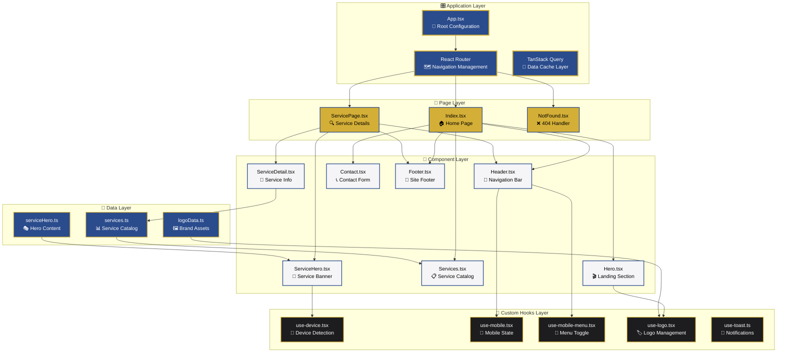
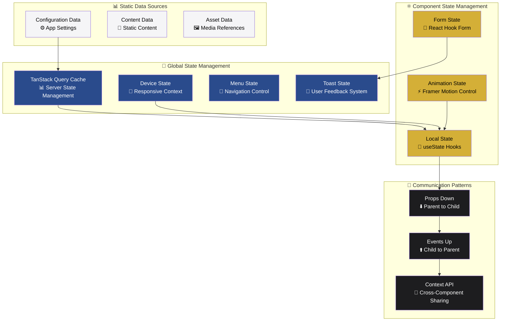
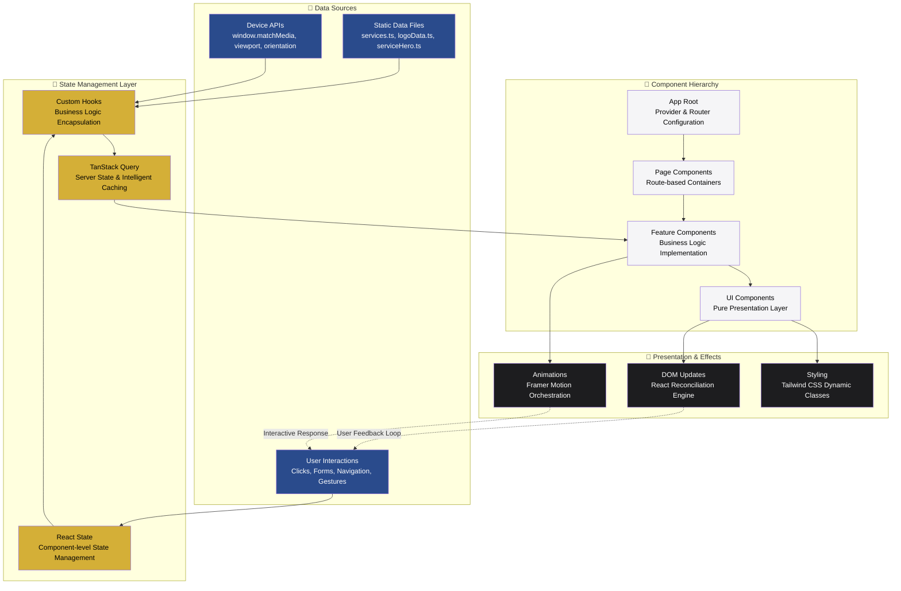
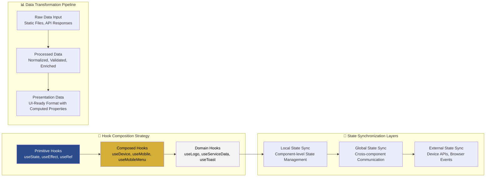
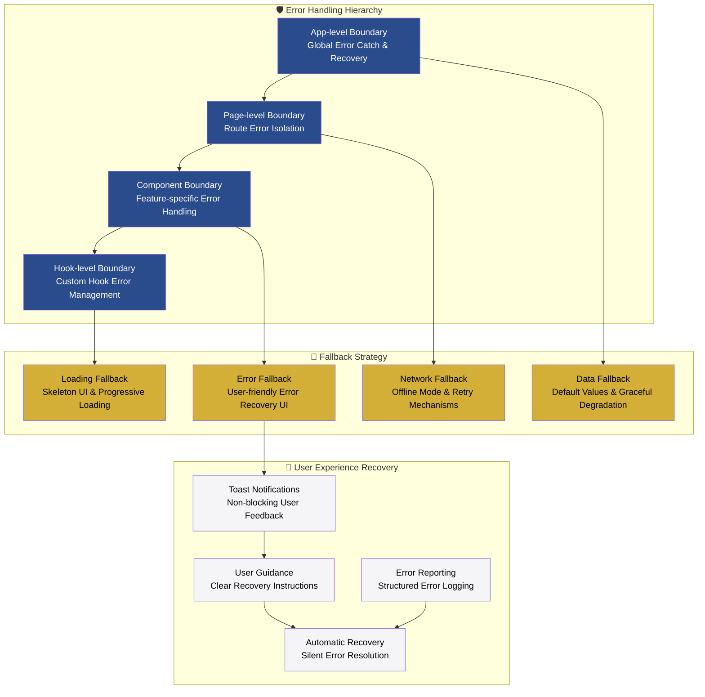

<div align="center">
  
  
  # 🏢 Cuenca & Asociados
  ### Plataforma Web Profesional de Auditoría Financiera, Contable y Tributaria
  
  <p align="center">
    <strong>Soluciones integrales de auditoría con tecnología de vanguardia</strong>
  </p>
  
  <p align="center">
    
    
    
    
  </p>
  
  <p align="center">
    
    
    
    
  </p>

  <div align="center" style="margin: 30px 0;">
    <table>
      <tr>
        <td align="center">
          
        </td>
        <td align="center">
          
        </td>
        <td align="center">
          
        </td>
      </tr>
    </table>
  </div>
</div>

---

## 📋 Índice de Contenidos

<table align="center">
<tr>
<td width="50%">

### 🎯 **Información del Proyecto**
- [📖 Descripción del Proyecto](#-descripción-del-proyecto)
- [✨ Características Principales](#-características-principales)
- [🛠️ Stack Tecnológico](#️-stack-tecnológico)
- [🚀 Instalación y Configuración](#-instalación-y-configuración)

</td>
<td width="50%">

### 🏗️ **Arquitectura Técnica**
- [🏗️ Arquitectura del Proyecto](#️-arquitectura-del-proyecto)
- [📊 Flujo de Datos](#-flujo-de-datos)
- [📈 Optimización de Rendimiento](#-optimización-de-rendimiento)
- [🎨 Sistema de Diseño](#-sistema-de-diseño)

</td>
</tr>
</table>

<div align="center">

### 📁 **Documentación Técnica**
[Estructura de Archivos](#-estructura-de-archivos) • [Scripts Disponibles](#-scripts-disponibles) • [Despliegue](#-despliegue) • [Licencia](#-licencia)

</div>

---

## 🎯 Descripción del Proyecto

> **Cuenca & Asociados** es una aplicación web profesional de última generación, desarrollada con **React 18** y **TypeScript**, que ofrece servicios especializados de auditoría financiera, contable y tributaria.

<div align="center">
  <table>
    <tr>
      <td align="center" width="25%">
        <br>
        <b>Sistema de Diseño Profesional</b><br>
        <small>Componentes reutilizables y consistentes</small>
      </td>
      <td align="center" width="25%">
        <br>
        <b>Optimización Avanzada</b><br>
        <small>Code splitting y lazy loading</small>
      </td>
      <td align="center" width="25%">
        <br>
        <b>Diseño Adaptativo</b><br>
        <small>Mobile-first approach</small>
      </td>
      <td align="center" width="25%">
        <br>
        <b>TypeScript Estricto</b><br>
        <small>Tipado robusto en toda la app</small>
      </td>
    </tr>
  </table>
</div>

### 🎪 Propósito Empresarial

<details>
<summary><b>🎯 Objetivos Estratégicos</b></summary>

- **🏢 Presentación Profesional**: Showcase elegante de servicios de auditoría
- **🤝 Comunicación Efectiva**: Canal directo entre la firma y sus clientes  
- **📱 Experiencia Optimizada**: UX excepcional en todos los dispositivos
- **🎨 Excelencia Técnica**: Reflejo de la calidad de servicios ofrecidos

</details>

---

## ✨ Características Principales

<div align="center">
  <table>
    <tr>
      <td width="50%" valign="top">
        <h3>🎭 Experiencia de Usuario Inmersiva</h3>
        <ul>
          <li><b>🌊 Animaciones Fluidas</b> - Framer Motion + AOS</li>
          <li><b>🔄 Transiciones Suaves</b> - Entre secciones y páginas</li>
          <li><b>✨ Micro-interacciones</b> - Feedback visual mejorado</li>
          <li><b>📱 Diseño Responsivo</b> - Mobile, tablet y desktop</li>
        </ul>
      </td>
      <td width="50%" valign="top">
        <h3>🏢 Presentación Profesional</h3>
        <ul>
          <li><b>📊 Catálogo Dinámico</b> - Servicios de auditoría</li>
          <li><b>📋 Páginas Detalladas</b> - Info completa por servicio</li>
          <li><b>🎬 Hero Interactivo</b> - Presentación visual impactante</li>
          <li><b>🧭 Navegación Intuitiva</b> - UX optimizada</li>
        </ul>
      </td>
    </tr>
  </table>
</div>

---

## 🛠️ Stack Tecnológico

<div align="center">
  <h3>🚀 Frontend Core Technologies</h3>
  <table>
    <tr>
      <td align="center" width="25%">
        <br>
        <b>React 18.3.1</b><br>
        <small>UI Library</small>
      </td>
      <td align="center" width="25%">
        <br>
        <b>TypeScript 5.0+</b><br>
        <small>Type Safety</small>
      </td>
      <td align="center" width="25%">
        <br>
        <b>Vite 6.3.0</b><br>
        <small>Build Tool</small>
      </td>
      <td align="center" width="25%">
        <br>
        <b>Tailwind CSS 4.1.0</b><br>
        <small>Styling Framework</small>
      </td>
    </tr>
  </table>
</div>

<details>
<summary><b>📦 Dependencias Completas del Proyecto</b></summary>

```json
{
  "Frontend Core": {
    "react": "18.3.1",
    "typescript": "5.0+",
    "vite": "6.3.0",
    "react-router-dom": "6.26.2"
  },
  "UI & Styling": {
    "tailwindcss": "4.1.0",
    "@radix-ui/*": "Latest",
    "shadcn/ui": "Latest",
    "framer-motion": "12.5.0",
    "lucide-react": "0.462.0"
  },
  "State Management": {
    "@tanstack/react-query": "5.56.2",
    "react-hook-form": "7.53.0",
    "zod": "3.23.8"
  },
  "Animation & Effects": {
    "framer-motion": "12.5.0",
    "aos": "2.3.4",
    "tailwindcss-animate": "1.0.7"
  }
}
```

</details>

---

## 🏗️ Arquitectura del Proyecto

### 📐 Diagrama de Arquitectura Modular



### 🔄 Arquitectura de Estado y Comunicación



---

## 📊 Flujo de Datos

### 🌊 Arquitectura de Flujo Unidireccional

Como desarrollador principal, he implementado un patrón de flujo de datos unidireccional que garantiza la **predictibilidad**, **mantenibilidad** y **escalabilidad** del código. El sistema sigue el principio **"single source of truth"** con múltiples capas de abstracción bien definidas.



### 🎣 Estrategia de Composición de Custom Hooks



### 🏗️ Patrones de Comunicación entre Componentes

Como arquitecto del sistema, he implementado múltiples patrones de comunicación para mantener el **acoplamiento bajo** y la **cohesión alta**:

#### **1. Props Drilling con TypeScript Estricto**
```typescript
// Patrón de props tipado estrictamente para type safety
interface ServiceHeroProps {
  serviceId: string;
  className?: string;
  onServiceChange?: (serviceId: string) => void;
}

// Flujo: ServicePage → ServiceHero → ServiceDetail → LogoDisplay
```

#### **2. Custom Hooks para Estado Compartido**
```typescript
// Hook centralizado para gestión de estado de dispositivo
const useDevice = () => {
  const [deviceType, setDeviceType] = useState<DeviceType>('desktop');
  const [orientation, setOrientation] = useState<'portrait' | 'landscape'>('landscape');
  
  // Lógica de detección, sincronización y cleanup
  return { 
    deviceType, 
    isMobile, 
    isTablet, 
    isDesktop,
    orientation,
    breakpoint: getBreakpoint(deviceType)
  };
};
```

#### **3. Event Bubbling con Synthetic Events**
```typescript
// Patrón de eventos que propagan hacia componentes padre
const handleServiceInteraction = useCallback((
  serviceId: string, 
  action: 'view' | 'select' | 'contact'
) => {
  // Event propagation con metadata enriquecida
  onServiceAction?.({ 
    serviceId, 
    action, 
    timestamp: Date.now(),
    deviceContext: deviceType 
  });
}, [onServiceAction, deviceType]);
```

---

## 📈 Optimización de Rendimiento

### ⚡ Estrategias de Optimización Avanzadas

```mermaid
graph TB
    subgraph "🚀 Code Optimization Layer"
        LL[Lazy Loading<br/>React.lazy() + Dynamic Imports]
        CS[Code Splitting<br/>Route-based & Component-based]
        TS[Tree Shaking<br/>Dead Code Elimination]
        BC[Bundle Compression<br/>Gzip + Brotli]
    end
    
    subgraph "💾 Caching & Memoization Strategy"
        QC[TanStack Query Cache<br/>Intelligent Server State Management]
        MC[Memory Cache<br/>useMemo + useCallback Optimization]
        RC[React Memoization<br/>React.memo + shouldComponentUpdate]
        BC2[Browser Cache<br/>Service Workers + Cache API]
    end
    
    subgraph "🎯 Runtime Performance"
        VD[Virtual DOM Optimization<br/>React Fiber Reconciliation]
        EP[Event Pooling<br/>Synthetic Event Optimization]
        RP[Render Prioritization<br/>Concurrent Features]
        LP[Loading Prioritization<br/>Critical Resource Loading]
    end
    
    subgraph "📊 Performance Monitoring"
        WV[Web Vitals<br/>CLS, LCP, FID, INP Tracking]
        PM[Performance Metrics<br/>Bundle Size, Load Time Analysis]
        EM[Error Monitoring<br/>Runtime Error Tracking]
        UM[User Metrics<br/>Real User Monitoring (RUM)]
    end
    
    LL --> CS
    CS --> TS
    TS --> BC
    
    QC --> MC
    MC --> RC
    RC --> BC2
    
    VD --> EP
    EP --> RP
    RP --> LP
    
    WV --> PM
    PM --> EM
    EM --> UM
    
    classDef codeOpt fill:#2A4B8C,color:#fff
    classDef caching fill:#D4AF37,color:#000
    classDef runtime fill:#F5F5F7,color:#000
    classDef monitoring fill:#1D1D1F,color:#fff
    
    class LL,CS,TS,BC codeOpt
    class QC,MC,RC,BC2 caching
    class VD,EP,RP,LP runtime
    class WV,PM,EM,UM monitoring
```

### 🔧 Implementación Técnica de Optimizaciones

#### **Code Splitting Estratégico**
```typescript
// Implementación en App.tsx con Suspense boundaries
const Index = lazy(() => import("./pages/Index"));
const ServicePage = lazy(() => import("./pages/ServicePage"));
const NotFound = lazy(() => import("./pages/NotFound"));

// Route-based splitting con preloading condicional
const ServiceDetail = lazy(() => 
  import("./components/ServiceDetail").then(module => ({
    default: module.ServiceDetail
  }))
);
```

#### **TanStack Query Configuración Avanzada**
```typescript
const queryClient = new QueryClient({
  defaultOptions: {
    queries: {
      staleTime: 5 * 60 * 1000,      // 5 minutos de cache
      cacheTime: 10 * 60 * 1000,     // 10 minutos de retención
      retry: (failureCount, error) => {
        if (error?.status === 404) return false;
        return failureCount < 2;
      },
      refetchOnWindowFocus: false,
      refetchOnReconnect: 'always'
    },
  },
});
```

#### **Performance Budgets y Métricas**
```typescript
// Configuración de performance budgets
const PERFORMANCE_BUDGETS = {
  bundleSize: {
    main: '250KB',        // Bundle principal
    vendor: '500KB',      // Dependencias
    assets: '2MB'         // Assets totales
  },
  metrics: {
    FCP: 1500,           // First Contentful Paint < 1.5s
    LCP: 2500,           // Largest Contentful Paint < 2.5s
    FID: 100,            // First Input Delay < 100ms
    CLS: 0.1             // Cumulative Layout Shift < 0.1
  }
};
```

### 🛡️ Error Boundary & Resilience Patterns



---

## 🚀 Instalación y Configuración

<div align="center">
  <h3>🔧 Configuración del Entorno de Desarrollo</h3>
</div>

### 📋 Prerrequisitos del Sistema

<table align="center">
<tr>
<td align="center" width="25%">
<br>
<b>Node.js</b><br>
<code>>= 18.0.0</code>
</td>
<td align="center" width="25%">
<br>
<b>npm/yarn</b><br>
<code>>= 9.0.0</code>
</td>
<td align="center" width="25%">
<br>
<b>Git</b><br>
<code>Latest</code>
</td>
<td align="center" width="25%">
<br>
<b>VS Code</b><br>
<code>Recomendado</code>
</td>
</tr>
</table>

### 🚀 Instalación Rápida

```bash
# 📥 Clonar el repositorio
git clone https://github.com/tu-usuario/cuenca-asociados.git

# 📁 Navegar al directorio del proyecto
cd cuenca-asociados

# 📦 Instalar todas las dependencias
npm install

# 🚀 Iniciar el servidor de desarrollo
npm run dev
```

<div align="center">
  <h4>🌐 Acceso Local</h4>
  <table>
    <tr>
      <td><b>🏠 Desarrollo Local:</b></td>
      <td><code>http://localhost:8080</code></td>
    </tr>
    <tr>
      <td><b>🌍 Red Local:</b></td>
      <td><code>http://[tu-ip]:8080</code></td>
    </tr>
  </table>
</div>

---

## 🎨 Sistema de Diseño

### 🎨 Arquitectura del Design System

<div align="center">
  <h4>🎯 Design Tokens & Component Variants</h4>
  <p>Sistema de diseño escalable basado en <b>Design Tokens</b> y <b>Component Variants</b></p>
</div>

#### **🎨 Tokens Corporativos de Cuenca & Asociados**
```css
/* Variables CSS globales definidas en index.css */
:root {
  /* 🏢 Colores corporativos principales */
  --cuenca-blue: #2A4B8C;      /* Azul corporativo - Confianza y profesionalismo */
  --cuenca-gold: #D4AF37;      /* Dorado premium - Excelencia y prestigio */
  --cuenca-light: #F5F5F7;     /* Gris claro - Elegancia y modernidad */
  --cuenca-dark: #1D1D1F;      /* Gris oscuro - Solidez y autoridad */
  
  /* 🎯 Semantic tokens para theming dinámico */
  --primary: 213 31% 36%;       /* HSL del azul corporativo */
  --secondary: 48 69% 52%;      /* HSL del dorado de excelencia */
  --background: 0 0% 96%;       /* Fondo principal neutro */
  --foreground: 0 0% 11%;       /* Texto principal de alto contraste */
}
```

#### **🔧 Función Central del Sistema (`cn` utility)**
```typescript
// src/lib/utils.ts - Corazón del sistema de diseño
import { type ClassValue, clsx } from "clsx"
import { twMerge } from "tailwind-merge"

export function cn(...inputs: ClassValue[]) {
  return twMerge(clsx(inputs))
}

// Uso en componentes para variantes dinámicas y condicionales
cn(
  "bg-cuenca-blue text-white transition-all duration-300",
  isActive && "bg-cuenca-gold shadow-lg",
  isLoading && "opacity-50 cursor-not-allowed"
)
```

### 📝 Sistema Tipográfico Profesional

<div align="center">
  <table>
    <tr>
      <td align="center" width="50%">
        <h4>🎭 Jerarquía de Fuentes</h4>
        <b>Poppins</b> - Interface & UI<br>
        <b>Playfair Display</b> - Títulos & Headers
      </td>
      <td align="center" width="50%">
        <h4>📏 Escala Tipográfica</h4>
        <code>text-5xl</code> → Títulos principales (48px)<br>
        <code>text-base</code> → Texto base (16px)
      </td>
    </tr>
  </table>
</div>

---

## 📁 Estructura de Archivos

<div align="center">
  <h3>🗂️ Organización Modular del Proyecto</h3>
</div>

```
📦 cuenca-asociados/
├── 📁 src/
│   ├── 📁 components/           # 🧩 Componentes React reutilizables
│   │   ├── 📁 ui/              # 🎨 Componentes UI base (Shadcn/UI)
│   │   │   ├── 📄 button.tsx   # Botones con variantes
│   │   │   ├── 📄 card.tsx     # Cards responsivas
│   │   │   └── 📄 ...          # Más componentes UI
│   │   ├── 📄 Header.tsx       # 🧭 Navegación principal
│   │   ├── 📄 Hero.tsx         # 🎬 Sección hero landing
│   │   ├── 📄 ServiceHero.tsx  # 🎥 Hero específico de servicios
│   │   ├── 📄 Services.tsx     # 📋 Catálogo de servicios
│   │   ├── 📄 Contact.tsx      # 📞 Formulario de contacto
│   │   └── 📄 Footer.tsx       # 📰 Pie de página corporativo
│   ├── 📁 hooks/               # 🎣 Custom React Hooks
│   │   ├── 📄 use-device.tsx   # 📱 Detección inteligente de dispositivos
│   │   ├── 📄 use-mobile.tsx   # 📲 Estado móvil simplificado
│   │   ├── 📄 use-logo.tsx     # 🏷️ Gestión dinámica del logotipo
│   │   └── 📄 use-toast.ts     # 🔔 Sistema de notificaciones
│   ├── 📁 data/                # 💾 Fuentes de datos y configuración
│   │   ├── 📄 services.ts      # 📊 Catálogo completo de servicios
│   │   ├── 📄 logoData.ts      # 🖼️ Configuración de assets de marca
│   │   └── 📄 serviceHero.ts   # 🎭 Contenido de heros de servicios
│   ├── 📁 pages/               # 📄 Páginas principales de la aplicación
│   │   ├── 📄 Index.tsx        # 🏠 Página de inicio principal
│   │   ├── 📄 ServicePage.tsx  # 🔍 Página individual de servicio
│   │   └── 📄 NotFound.tsx     # ❌ Página 404 personalizada
│   ├── 📁 lib/                 # 🔧 Utilidades y helpers
│   │   └── 📄 utils.ts         # 🛠️ Funciones de utilidad comunes
│   ├── 📄 App.tsx              # ⚛️ Componente raíz de la aplicación
│   ├── 📄 main.tsx             # 🚀 Punto de entrada de React
│   └── 📄 index.css            # 🎨 Estilos globales y variables CSS
├── 📁 public/                  # 📂 Assets públicos estáticos
├── 📄 package.json             # 📦 Configuración de dependencias
├── 📄 tailwind.config.ts       # 🎨 Configuración de Tailwind CSS
├── 📄 vite.config.ts           # ⚡ Configuración de Vite
└── 📄 README.md                # 📖 Documentación del proyecto
```

---

## 🔧 Scripts de Desarrollo

<div align="center">
  <table>
    <tr>
      <th width="30%">🚀 Comando</th>
      <th width="70%">📝 Descripción</th>
    </tr>
    <tr>
      <td><code>npm run dev</code></td>
      <td>🔥 Inicia servidor de desarrollo con hot reload</td>
    </tr>
    <tr>
      <td><code>npm run build</code></td>
      <td>📦 Construye aplicación optimizada para producción</td>
    </tr>
    <tr>
      <td><code>npm run preview</code></td>
      <td>👀 Previsualiza build de producción localmente</td>
    </tr>
    <tr>
      <td><code>npm run lint</code></td>
      <td>🔍 Ejecuta linting y análisis de código</td>
    </tr>
  </table>
</div>

---

## 🌐 Despliegue

<div align="center">
  <h3>🚀 Opciones de Despliegue en Producción</h3>
  <table>
    <tr>
      <td align="center" width="25%">
        <br>
        <b>Vercel</b><br>
        <small>Recomendado para React</small>
      </td>
      <td align="center" width="25%">
        <br>
        <b>Netlify</b><br>
        <small>Ideal para sitios estáticos</small>
      </td>
      <td align="center" width="25%">
        <br>
        <b>GitHub Pages</b><br>
        <small>Para proyectos open source</small>
      </td>
      <td align="center" width="25%">
        <br>
        <b>AWS S3</b><br>
        <small>Escalabilidad empresarial</small>
      </td>
    </tr>
  </table>
</div>

### 📦 Preparación para Producción

```bash
# 🏗️ Generar build optimizado para producción
npm run build

# 📊 Analizar bundle size y performance
npm run build -- --analyze

# 📁 El directorio 'dist/' contiene los archivos listos para despliegue
# 📈 Optimizaciones incluidas: minificación, tree-shaking, code-splitting
```

---

## 📄 Licencia

<div align="center">
  <p>Este proyecto está bajo la <b>Licencia MIT</b></p>
  <p>Ver el archivo <a href="LICENSE">LICENSE</a> para más detalles</p>
</div>

---

<div align="center">
  <h2>💼 Desarrollado para Cuenca & Asociados</h2>
  <p><em>Excelencia en Auditoría Financiera, Contable y Tributaria</em></p>
  
  <table>
    <tr>
      <td align="center">
        
      </td>
      <td align="center">
        
      </td>
      <td align="center">
        
      </td>
    </tr>
  </table>
  
  <p><sub>🏆 Desarrollado con las mejores prácticas de la industria</sub></p>
</div>
