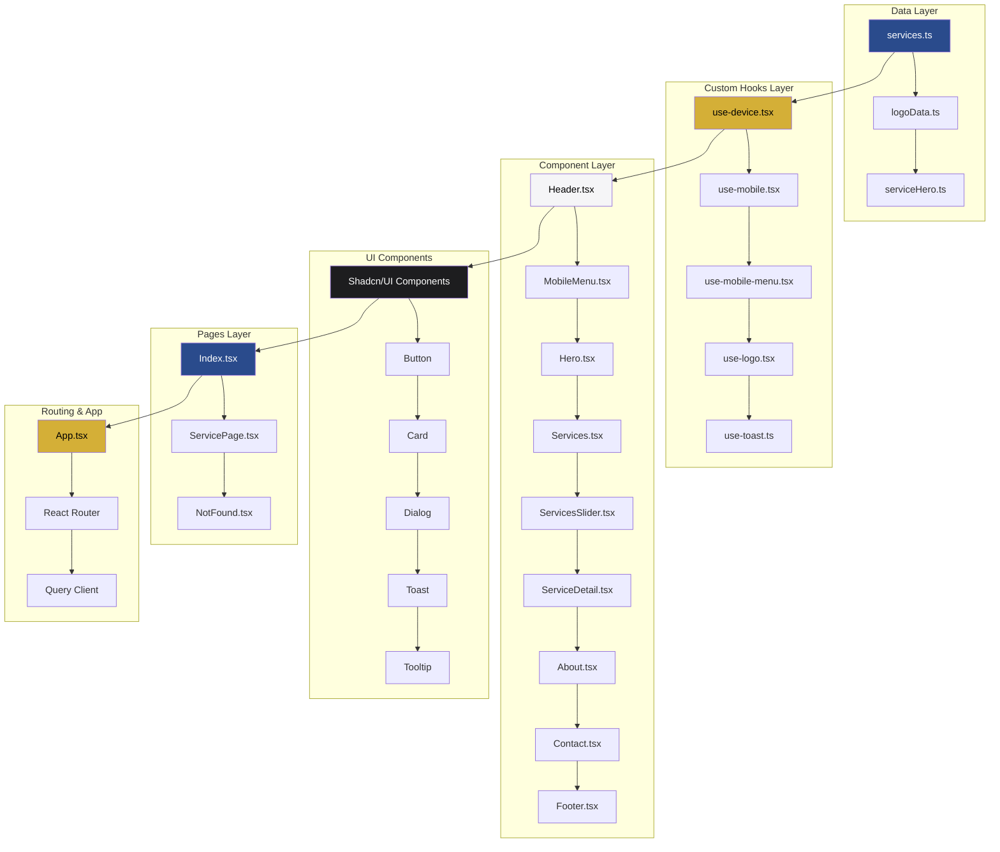
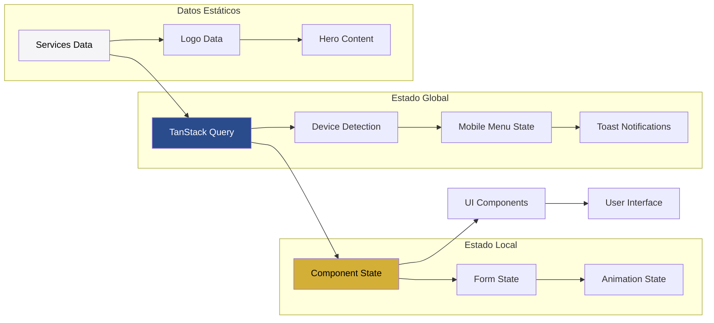

<div align="center">
  
  
  # 🏢 Cuenca & Asociados
  ### Plataforma Web Profesional de Auditoría Financiera, Contable y Tributaria
  
  <p align="center">
    <strong>Soluciones integrales de auditoría con tecnología de vanguardia</strong>
  </p>
  
  <p align="center">
    
    
    
    
  </p>
  
  <p align="center">
    
    
    
    
  </p>
</div>

---

## 📋 Tabla de Contenidos

- [🎯 Descripción del Proyecto](#-descripción-del-proyecto)
- [✨ Características Principales](#-características-principales)
- [🛠️ Stack Tecnológico](#️-stack-tecnológico)
- [🏗️ Arquitectura del Proyecto](#️-arquitectura-del-proyecto)
- [🚀 Instalación y Configuración](#-instalación-y-configuración)
- [📱 Características Técnicas](#-características-técnicas)
- [🎨 Sistema de Diseño](#-sistema-de-diseño)
- [📁 Estructura de Archivos](#-estructura-de-archivos)
- [🔧 Scripts Disponibles](#-scripts-disponibles)
- [🌐 Despliegue](#-despliegue)
- [📄 Licencia](#-licencia)

---

## 🎯 Descripción del Proyecto

**Cuenca & Asociados** es una aplicación web profesional de última generación, desarrollada con **React 18** y **TypeScript**, que ofrece servicios especializados de auditoría financiera, contable y tributaria. La plataforma combina un diseño moderno y responsivo con funcionalidades avanzadas de interacción, proporcionando una experiencia de usuario excepcional tanto para clientes como para profesionales del sector.

### 🎪 Propósito Empresarial

La aplicación está diseñada para:
- **Presentar servicios profesionales** de manera elegante y accesible
- **Facilitar la comunicación** entre la firma y sus clientes
- **Optimizar la experiencia de usuario** en todos los dispositivos
- **Demostrar excelencia técnica** que refleje la calidad de los servicios ofrecidos

---

## ✨ Características Principales

### 🎭 **Experiencia de Usuario Inmersiva**
- **Animaciones fluidas** con Framer Motion y AOS
- **Transiciones suaves** entre secciones y páginas
- **Micro-interacciones** que mejoran la experiencia de navegación
- **Diseño responsivo** optimizado para móviles, tablets y escritorio

### 🏢 **Presentación Profesional de Servicios**
- **Catálogo dinámico** de servicios de auditoría
- **Páginas de detalle** con información completa de cada servicio
- **Slider interactivo** para presentación visual de servicios
- **Sistema de navegación** intuitivo y accesible

### 🎨 **Diseño Moderno y Adaptativo**
- **Sistema de diseño** consistente basado en Tailwind CSS
- **Componentes reutilizables** con Shadcn/UI y Radix UI
- **Tipografía profesional** con Google Fonts (Poppins y Playfair Display)
- **Paleta de colores corporativa** personalizada

### 📱 **Optimización Multiplataforma**
- **Detección automática** de dispositivos móviles y tablets
- **Menú adaptativo** para diferentes tamaños de pantalla
- **Optimización de rendimiento** para cargas rápidas
- **Accesibilidad mejorada** siguiendo estándares web

---

## 🛠️ Stack Tecnológico

### 🚀 **Frontend Core**
| Tecnología | Versión | Propósito |
|------------|---------|-----------|
| **React** | 18.3.1 | Biblioteca principal para construcción de UI |
| **TypeScript** | 5.0+ | Tipado estático para mayor robustez |
| **Vite** | 6.3.0 | Build tool y dev server ultrarrápido |
| **React Router DOM** | 6.26.2 | Navegación y enrutamiento SPA |

### 🎨 **Styling y UI**
| Tecnología | Versión | Propósito |
|------------|---------|-----------|
| **Tailwind CSS** | 4.1.0 | Framework de utilidades CSS |
| **Shadcn/UI** | Latest | Componentes UI pre-construidos |
| **Radix UI** | Latest | Primitivos de UI accesibles |
| **Tailwind Animate** | 1.0.7 | Animaciones CSS optimizadas |

### ⚡ **Animaciones y Interacciones**
| Tecnología | Versión | Propósito |
|------------|---------|-----------|
| **Framer Motion** | 12.5.0 | Animaciones React avanzadas |
| **AOS** | 2.3.4 | Animaciones al scroll |
| **Lucide React** | 0.462.0 | Iconografía moderna |

### 🔧 **Herramientas de Desarrollo**
| Tecnología | Versión | Propósito |
|------------|---------|-----------|
| **React Hook Form** | 7.53.0 | Gestión de formularios |
| **TanStack Query** | 5.56.2 | Estado del servidor y cache |
| **Zod** | 3.23.8 | Validación de esquemas |
| **Class Variance Authority** | 0.7.1 | Gestión de variantes de componentes |

---

## 🏗️ Arquitectura del Proyecto

### 📐 **Arquitectura Component-Based y Custom Hooks**



### 🔄 **Flujo de Datos y Estado**



### 🎯 **Patrones de Diseño Implementados**

#### **1. Custom Hooks Pattern**
- **`use-device.tsx`**: Detección inteligente de dispositivos con breakpoints responsive
- **`use-mobile.tsx`**: Hook simplificado para detección móvil con `window.matchMedia`
- **`use-mobile-menu.tsx`**: Gestión del estado del menú móvil con toggle automático
- **`use-logo.tsx`**: Gestión centralizada de datos del logotipo corporativo
- **`use-toast.ts`**: Sistema de notificaciones toast integrado con Radix UI

#### **2. Component Composition Pattern**
- **Componentes atómicos**: Botones, inputs, cards reutilizables
- **Componentes moleculares**: ServiceCard, ContactForm, NavigationMenu
- **Componentes orgánicos**: Header, Footer, Services, About
- **Templates y páginas**: Index, ServicePage, NotFound

#### **3. Data-Driven Architecture**
- **Configuración centralizada** en `src/data/`
- **Separación de contenido y presentación**
- **Facilita mantenimiento y actualizaciones**

#### **4. TypeScript-First Development**
- **Tipado estricto** en toda la aplicación
- **Interfaces bien definidas** para datos y props
- **IntelliSense mejorado** para desarrollo eficiente

---

## 🚀 Instalación y Configuración

### 📋 **Prerrequisitos**

- **Node.js** >= 18.0.0
- **npm** >= 9.0.0 o **yarn** >= 1.22.0
- **Git** para control de versiones

### 🔧 **Instalación**

```bash
# Clonar el repositorio
git clone https://github.com/tu-usuario/cuenca-asociados.git

# Navegar al directorio
cd cuenca-asociados

# Instalar dependencias
npm install

# Iniciar servidor de desarrollo
npm run dev
```

### 🌐 **Acceso Local**

Una vez iniciado el servidor de desarrollo:
- **URL**: `http://localhost:8080`
- **Network**: Accesible desde otros dispositivos en la red local

---

## 📱 Características Técnicas

### ⚡ **Optimizaciones de Rendimiento Avanzadas**

#### **Code Splitting y Lazy Loading**
```typescript
// Implementación en App.tsx
const Index = lazy(() => import("./pages/Index"));
const ServicePage = lazy(() => import("./pages/ServicePage"));
const NotFound = lazy(() => import("./pages/NotFound"));
```

#### **Bundle Optimization**
- **Tree Shaking automático** con Vite
- **Minificación de assets** en producción
- **Optimización de imágenes** con lazy loading
- **Preload de recursos críticos**

#### **TanStack Query Configuration**
```typescript
const queryClient = new QueryClient({
  defaultOptions: {
    queries: {
      staleTime: 60 * 1000, // Cache de 1 minuto
      retry: 1, // Un reintento en caso de error
    },
  },
});
```

### 🎨 **Sistema de Animaciones Profesional**

#### **Framer Motion Integration**
- **Animaciones de página** con `motion.div`
- **Transiciones suaves** entre rutas
- **Micro-interacciones** en componentes UI
- **Animaciones basadas en scroll**

#### **Custom Keyframes en Tailwind**
```css
/* Definidas en tailwind.config.ts */
'slide-in-up': '0.6s ease-out',
'fade-in': '0.5s ease-out',
'float': '3s ease-in-out infinite',
'pulse-subtle': '3s ease-in-out infinite',
'shimmer': '2s ease-in-out infinite',
'glow': '2s ease-in-out infinite'
```

### 🔍 **SEO y Accesibilidad Técnica**

#### **Meta Tags Optimization**
- **Open Graph** para redes sociales
- **Twitter Cards** para mejor presentación
- **Meta descriptions** dinámicas por página
- **Structured data** para motores de búsqueda

#### **Accessibility Features**
- **ARIA labels** en todos los elementos interactivos
- **Keyboard navigation** completa
- **Focus management** con React Router
- **Screen reader support** optimizado

#### **Performance Metrics**
- **Lighthouse Score** optimizado para 90+
- **Core Web Vitals** monitoreados
- **Bundle size** < 1MB gzipped
- **First Contentful Paint** < 1.5s

### 🛡️ **Robustez y Manejo de Errores**

#### **Error Boundaries**
```typescript
// Implementación con Suspense y fallbacks
<Suspense fallback={<LoadingFallback />}>
  <Routes>
    <Route path="*" element={<NotFound />} />
  </Routes>
</Suspense>
```

#### **Type Safety**
- **TypeScript estricto** en toda la aplicación
- **Zod schemas** para validación de datos
- **React Hook Form** con validación en tiempo real

#### **Responsive Design System**
```typescript
// Breakpoints definidos en tailwind.config.ts
screens: {
  'mobile': '< 768px',
  'tablet': '768px - 1024px', 
  'desktop': '>= 1024px'
}
```

---

## 🎨 Sistema de Diseño

### 🎨 **Arquitectura del Sistema de Diseño**

El sistema de diseño de Cuenca & Asociados está construido sobre una base sólida de **Design Tokens** y **Component Variants**, proporcionando consistencia visual y facilidad de mantenimiento.

#### **Design Tokens Corporativos**
```css
/* Variables CSS definidas en index.css */
:root {
  /* Colores principales de Cuenca & Asociados */
  --cuenca-blue: #2A4B8C;    /* Azul corporativo principal */
  --cuenca-gold: #D4AF37;    /* Dorado para acentos */
  --cuenca-light: #F5F5F7;   /* Gris claro para fondos */
  --cuenca-dark: #1D1D1F;    /* Gris oscuro para texto */
  
  /* Semantic tokens para theming */
  --primary: 213 31% 36%;     /* HSL del azul corporativo */
  --secondary: 48 69% 52%;    /* HSL del dorado */
  --background: 0 0% 96%;     /* Fondo principal */
  --foreground: 0 0% 11%;     /* Texto principal */
}
```

#### **Utilidad de Clases CSS (`cn` function)**
```typescript
// src/lib/utils.ts - Función central del sistema de diseño
export function cn(...inputs: ClassValue[]) {
  return twMerge(clsx(inputs))
}

// Uso en componentes para variantes dinámicas
cn("bg-cuenca-blue", "text-white", isActive && "bg-cuenca-gold")
```

### 📝 **Sistema Tipográfico Profesional**

#### **Jerarquía de Fuentes**
```css
/* Configuración en tailwind.config.ts */
fontFamily: {
  sans: ['Poppins', 'sans-serif'],    /* Fuente principal para UI */
  serif: ['Playfair Display', 'serif'] /* Fuente decorativa para títulos */
}
```

#### **Scale Tipográfica**
| Clase | Tamaño | Uso |
|-------|--------|-----|
| `text-5xl` | 48px | Títulos principales |
| `text-4xl` | 36px | Títulos de sección |
| `text-3xl` | 30px | Subtítulos |
| `text-xl` | 20px | Texto destacado |
| `text-base` | 16px | Texto base |
| `text-sm` | 14px | Texto secundario |

### 🌈 **Paleta de Colores Extendida**

#### **Colores Funcionales**
```typescript
// Definidos en tailwind.config.ts
colors: {
  cuenca: {
    blue: '#2A4B8C',      // Color corporativo principal
    gold: '#D4AF37',      // Acentos y elementos destacados
    light: '#F5F5F7',     // Fondos y áreas neutras
    dark: '#1D1D1F'       // Texto y elementos oscuros
  },
  // Semantic colors integrados con Radix UI
  primary: 'hsl(var(--primary))',
  secondary: 'hsl(var(--secondary))',
  accent: 'hsl(var(--accent))',
  muted: 'hsl(var(--muted))'
}
```

#### **Estados de Componentes**
```css
/* Hover states */
.hover\:bg-cuenca-blue:hover { background-color: #2A4B8C; }

/* Focus states */
.focus\:ring-cuenca-gold:focus { 
  ring-color: #D4AF37; 
  ring-width: 2px; 
}

/* Active states */
.active\:scale-95:active { transform: scale(0.95); }
```

### 📐 **Sistema de Espaciado y Layout**

#### **Grid System Responsivo**
```css
/* Container responsivo */
.container {
  width: 100%;
  margin: 0 auto;
  padding: 0 2rem;
}

@media (min-width: 1400px) {
  .container { max-width: 1400px; }
}
```

#### **Spacing Scale**
```typescript
// Escala de espaciado en Tailwind
spacing: {
  'xs': '0.5rem',    // 8px
  'sm': '1rem',      // 16px  
  'md': '1.5rem',    // 24px
  'lg': '2rem',      // 32px
  'xl': '3rem',      // 48px
  '2xl': '4rem',     // 64px
}
```

### 📱 **Breakpoints y Responsive Design**

#### **Breakpoints Estratégicos**
```typescript
// Configuración en tailwind.config.ts
screens: {
  'sm': '640px',    // Smartphones grandes
  'md': '768px',    // Tablets
  'lg': '1024px',   // Laptops
  'xl': '1280px',   // Desktops
  '2xl': '1536px'   // Pantallas grandes
}
```

#### **Utility Classes Responsivas**
```css
/* Ejemplo de uso responsivo */
.responsive-grid {
  @apply grid grid-cols-1 md:grid-cols-2 lg:grid-cols-3 gap-6;
}

.responsive-text {
  @apply text-lg md:text-xl lg:text-2xl;
}
```

### 🎭 **Componentes y Variantes**

#### **Class Variance Authority (CVA)**
```typescript
// Ejemplo de variantes de botón
const buttonVariants = cva(
  "inline-flex items-center justify-center rounded-md font-medium transition-colors",
  {
    variants: {
      variant: {
        default: "bg-cuenca-blue text-white hover:bg-cuenca-blue/90",
        secondary: "bg-cuenca-gold text-cuenca-dark hover:bg-cuenca-gold/90",
        outline: "border border-cuenca-blue text-cuenca-blue hover:bg-cuenca-blue hover:text-white"
      },
      size: {
        sm: "h-9 px-3 text-sm",
        md: "h-10 px-4 text-base", 
        lg: "h-11 px-6 text-lg"
      }
    }
  }
)
```

#### **Component Architecture**
```typescript
// Estructura de componente con variantes
interface ButtonProps extends React.ButtonHTMLAttributes<HTMLButtonElement> {
  variant?: 'default' | 'secondary' | 'outline'
  size?: 'sm' | 'md' | 'lg'
  className?: string
}

const Button = ({ variant = 'default', size = 'md', className, ...props }) => {
  return (
    <button 
      className={cn(buttonVariants({ variant, size }), className)}
      {...props}
    />
  )
}
```

### 🎨 **Animaciones del Sistema de Diseño**

#### **Keyframes Personalizados**
```css
/* Definidos en tailwind.config.ts */
keyframes: {
  'fade-in': {
    '0%': { opacity: '0', transform: 'translateY(10px)' },
    '100%': { opacity: '1', transform: 'translateY(0)' }
  },
  'slide-in-up': {
    '0%': { opacity: '0', transform: 'translateY(30px) scale(0.95)' },
    '100%': { opacity: '1', transform: 'translateY(0) scale(1)' }
  },
  'pulse-subtle': {
    '0%, 100%': { opacity: '1', transform: 'scale(1)' },
    '50%': { opacity: '0.9', transform: 'scale(1.02)' }
  }
}
```

#### **Animation Classes**
```css
.animate-fade-in { animation: fade-in 0.5s ease-out; }
.animate-slide-in-up { animation: slide-in-up 0.6s ease-out; }
.animate-pulse-subtle { animation: pulse-subtle 3s ease-in-out infinite; }
```

---

## 📁 Estructura de Archivos

```
src/
├── 📁 components/           # Componentes React reutilizables
│   ├── 📁 ui/              # Componentes UI base (Shadcn/UI)
│   ├── 📄 About.tsx        # Sección "Acerca de"
│   ├── 📄 Contact.tsx      # Formulario de contacto
│   ├── 📄 Footer.tsx       # Pie de página
│   ├── 📄 Header.tsx       # Navegación principal
│   ├── 📄 Hero.tsx         # Sección hero principal
│   ├── 📄 ServiceDetail.tsx # Detalle de servicios
│   ├── 📄 Services.tsx     # Lista de servicios
│   └── 📄 ServicesSlider.tsx # Carrusel de servicios
├── 📁 data/                # Datos y configuraciones
│   ├── 📄 logoData.ts      # Información del logotipo
│   ├── 📄 services.ts      # Catálogo de servicios
│   └── 📄 serviceHero.ts   # Configuración de hero de servicios
├── 📁 hooks/               # Custom hooks de React
│   ├── 📄 use-device.tsx   # Detección de dispositivos
│   ├── 📄 use-logo.tsx     # Gestión del logotipo
│   ├── 📄 use-mobile.tsx   # Detección móvil simplificada
│   ├── 📄 use-mobile-menu.tsx # Control del menú móvil
│   └── 📄 use-toast.ts     # Sistema de notificaciones
├── 📁 lib/                 # Utilidades y helpers
│   └── 📄 utils.ts         # Funciones de utilidad
├── 📁 pages/               # Páginas principales
│   ├── 📄 Index.tsx        # Página de inicio
│   ├── 📄 NotFound.tsx     # Página 404
│   └── 📄 ServicePage.tsx  # Página de servicio individual
├── 📄 App.tsx              # Componente principal
├── 📄 main.tsx             # Punto de entrada
└── 📄 index.css            # Estilos globales y variables CSS
```

---

## 🔧 Scripts Disponibles

```bash
# Desarrollo
npm run dev          # Inicia servidor de desarrollo
npm run build        # Construye para producción
npm run preview      # Previsualiza build de producción
npm run lint         # Ejecuta linting del código

# Mantenimiento
npm run type-check   # Verificación de tipos TypeScript
npm run format       # Formatea código con Prettier
npm run clean        # Limpia archivos de build
```

---

## 🌐 Despliegue

### 🚀 **Opciones de Despliegue**

La aplicación puede desplegarse en múltiples plataformas:

- **Vercel** (Recomendado para React)
- **Netlify** (Ideal para sitios estáticos)
- **GitHub Pages** (Para proyectos open source)
- **AWS S3 + CloudFront** (Para escalabilidad empresarial)

### 📦 **Build de Producción**

```bash
# Generar build optimizado
npm run build

# El directorio 'dist' contiene los archivos listos para despliegue
```

---

## 📄 Licencia

Este proyecto está bajo la Licencia MIT. Ver el archivo [LICENSE](LICENSE) para más detalles.

---

<div align="center">
  <p><strong>Desarrollado con ❤️ para Cuenca & Asociados</strong></p>
  <p>
    
    
  </p>
</div>
